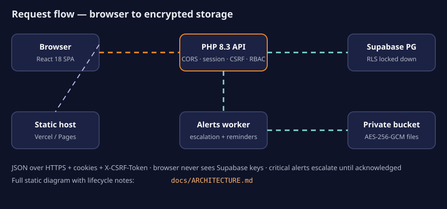

[](frontend/)
[](backend/)
[](services/alerts/)
[](database/)
[](render.yaml)
[](docs/TEST_REPORT.md)

# DiagnoCare

> Clinic website and secure patient & staff portal for **Meghnad Diagnostic Centre (MDC)**, Bhosari, Pune — in 30 seconds:

A patient books a scan online, clears a pre-scan safety checklist, and downloads an encrypted report. A critical finding **escalates by itself** until a human acknowledges it. Staff get a priority reading queue, reception gets an alert board, referrers track their patients, admins run the catalogue. One codebase, three runtimes, zero framework magic on the API.

## Why this architecture

| Problem | Design answer |
|---|---|
| Hospital data must survive shared hosting and small VPS budgets | Plain PHP 8.3 MVC, no framework to outgrow; PDO prepared statements everywhere |
| Reports are sensitive files, not rows | AES-256-GCM envelope encryption; private Supabase bucket; browser never sees storage keys |
| A missed critical finding can harm someone | PHP raises the alert with `next_escalation_at`; the Node worker escalates on a timer until acknowledgement |
| Cookies across Vercel + Render break silently | Same-origin dev proxy; documented `SameSite=None; Secure` + exact-origin CORS contract for prod |
| Graders need proof, not promises | 431 PHPUnit + 173 Vitest + 17 worker tests, a 45/45 live attack check, a 15-step full journey, 386 Postman assertions — all in [`docs/TEST_REPORT.md`](docs/TEST_REPORT.md) |



## 3-step quickstart



```bash
npm run setup                  # 1. install everything (root, frontend, worker, composer)
npm run migrate && npm run seed # 2. database + 56 scans, checklists, FAQs
npm run dev                    # 3. API :8000 · app :5173 · alerts :4000
```

Open `http://localhost:5173` (same-origin cookies). Dev logins after `npm run seed:dev`: `patient@diagnocare.test` / `Patient@Dev2026!` (plus admin, doctor, receptionist, referrer — full table in the setup collapsible below).

> Screenshots: drop yours into `assets/` and they'll be framed here with before/after captions — the animated diagrams above hold the fort meanwhile.

## Features by role

| Role | What they can do |
|---|---|
| Public visitor | Services (USG / CT / Biopsy filters), doctor profile, branch with maps, approved reviews, FAQ, contact, privacy & terms |
| Patient | Register + verify email, book / reschedule / cancel (row-locked capacity, other-branch suggestion when full), safety checklist, `.ics` + Google Calendar link, encrypted report downloads, critical-alert acknowledgement, visit reviews |
| Receptionist | Appointment list & status changes, report upload, referral linking, red-flag alert board, phone-contact logging |
| Doctor | Priority reading queue (Routine / Priority / Urgent + waiting time), encrypted-note uploads, flag Critical |
| Referrer | Create referrals, track status, download own patients' reports, acknowledge critical alerts |
| Admin | CRUD for users, branches, scans, checklist, slots, settings, FAQs, doctor profile, review moderation, audit log, stats |

## Tech stack

- **Frontend:** React 18, TypeScript, Vite, Redux Toolkit, React Router 6, Vitest + Testing Library
- **API:** plain PHP 8.3 MVC (own Router, middleware pipeline, container), PDO, PHPUnit
- **Worker:** Node.js 24, Express 5, `pg`, nodemailer
- **Data:** Supabase PostgreSQL (RLS locked down) + private Storage bucket
- **Delivery:** Docker; Render (API + worker); Vercel or Cloudflare Pages (frontend)

```
frontend/          React app (public site and portal)
backend/           PHP REST API (Core, Controllers, Models, Middleware, Services, Validation)
services/alerts/   Node worker: escalation, reminders, status page, rotating audit log
database/          SQL migrations and seeds
docs/              Architecture, API, security, syllabus mapping, conventions, test report
postman/           Postman collection
render.yaml        Render blueprint for API + worker
docker-compose.yml Local containers
```

<details>
<summary><strong>Full local setup (env, secrets, seeds)</strong></summary>

```bash
cp .env.example .env
```

Fill in `.env` (database, Supabase, SMTP for real mail). Generate three distinct secrets for `APP_KEY`, `ENCRYPTION_KEY`, `CSRF_SECRET`:

```bash
php -r "echo 'base64:' . base64_encode(random_bytes(32)), PHP_EOL;"
```

Worker token: `php -r "echo bin2hex(random_bytes(32)), PHP_EOL;"` → `ALERTS_SERVICE_TOKEN`.

```bash
npm run setup          # npm install (root, frontend, alerts) + composer install
npm run migrate        # apply database/migrations in order (migrate:status to inspect)
npm run seed           # production-safe base data
npm run seed:dev       # dev only: one user per role + two weeks of slots
npm run seed:demo      # dev only: reviews labelled "Demo data"
npm run storage:setup  # create the private reports bucket if missing
npm run db:counts      # row count per table
```

`seed:dev` / `seed:demo` refuse to run with `APP_ENV=production`. Purge demo reviews: `npm run seed:purge-demo`.

Without Docker, in separate terminals:

```bash
php -S localhost:8000 -t backend/public     # API
npm run dev --prefix frontend               # React app, Vite proxies /api to :8000
npm run dev --prefix services/alerts        # worker
```

With `MAIL_DRIVER=log`, verification/reset links land in `backend/storage/logs/mail.log`; set `MAIL_DRIVER=smtp` + `SMTP_*` for real mail.

| Role | Email | Password |
|---|---|---|
| admin | admin@diagnocare.test | Admin@Dev2026! |
| doctor | doctor@diagnocare.test | Doctor@Dev2026! |
| receptionist | reception@diagnocare.test | Reception@Dev2026! |
| patient | patient@diagnocare.test | Patient@Dev2026! |
| referrer | referrer@diagnocare.test | Referrer@Dev2026! |

Dev database only — never create these in production.

</details>

<details>
<summary><strong>Deploy (Supabase → Render → Vercel/Pages)</strong></summary>

Production layout: frontend on Vercel or Cloudflare Pages; API + worker on Render (Docker); database + bucket on Supabase.

**1. Supabase** — create a project, run `npm run migrate`, `npm run seed`, `npm run storage:setup` against it (never `seed:dev`/`seed:demo`). First admin via SQL:

```sql
INSERT INTO users (email, password_hash, role, full_name, email_verified_at, password_changed_at)
VALUES ('admin@your-domain.example', '<argon2id-hash>', 'admin', 'Clinic Admin', now(), now());
```

Generate the hash: `php -r "echo password_hash('CHOOSE-A-STRONG-PASSWORD', PASSWORD_ARGON2ID), PHP_EOL;"`. Sign in, change the password, create staff from the admin panel.

**2. Render** — New → Blueprint from this repo (`render.yaml`: `diagnocare-api` + `diagnocare-alerts`, health checks `/api/v1/health` and `/health`). Fill every `sync: false` variable: `APP_URL`, `FRONTEND_URL`, `CORS_ALLOWED_ORIGINS` (exact origins, no trailing slash), `APP_KEY`, `ENCRYPTION_KEY`, `CSRF_SECRET`, DB values, Supabase keys, `SMTP_*`, `MAIL_FROM`, worker `ALERTS_SERVICE_TOKEN`. Keep `ALERT_ESCALATION_MINUTES` identical on both services. Single API instance; attach a disk at `/var/www/backend/storage` if sessions/uploads must survive restarts (see `DECISIONS.md`).

**3. Frontend** — `VITE_API_BASE_URL=https://<api>/api/v1`, `SITE_URL=<live domain>`. Vercel: root `frontend` (`vercel.json` handles rewrite + headers). Cloudflare Pages: root `frontend`, build `npm run build`, output `dist`. Replace the placeholder API origin in `connect-src` (`vercel.json`, `public/_headers`) or browsers block API calls.

Cookie/CORS contract: cross-site needs `SameSite=None; Secure` over HTTPS both sides; `CORS_ALLOWED_ORIGINS` exact origins (no wildcards — cookies are sent); `TRUST_PROXY=true` only behind a trusted proxy; `APP_ENV=production` + `APP_DEBUG=false` for generic errors and HSTS.

</details>

<details>
<summary><strong>Encryption keys & rotation</strong></summary>

Reports, notes, impressions, referral notes: AES-256-GCM (`backend/src/Services/EncryptionService.php`), fresh 12-byte IV per value, envelope `dc:v<version>:<iv>:<tag>:<ciphertext>`. `STORAGE_DRIVER=supabase` (private bucket) or `local` (`backend/storage/reports`, git-ignored).

Rotate: new key → old into `ENCRYPTION_KEYS_PREVIOUS` (`1=base64:OLD`), bump `ENCRYPTION_KEY_VERSION` → preview `php backend/bin/rotate-encryption.php` → `--apply` → drop the old key when nothing references it. `CSRF_SECRET` rotates by replace + redeploy (browsers refetch automatically). Lose an encryption key = lose its data; keep keys in the host secret store, never in git.

</details>

<details>
<summary><strong>Test evidence (all runs real, see <code>docs/TEST_REPORT.md</code>)</strong></summary>

| Suite | Result |
|---|---|
| PHPUnit | 431 tests, 976 assertions, 0 failures |
| Vitest | 173 tests, 0 failures (was 146 at report time; UI/session fixes added coverage) |
| Alerts worker | 17/17 |
| Live attack check (SQLi/XSS/upload abuse, 45 cases) | 45/45, tables intact |
| Full-journey flow (register → book → checklist → report → alerts) | 15/15 steps, 260 s |
| Postman/newman | 174 requests, 386 assertions, 0 failed |

```bash
npm test               # PHPUnit + Vitest
npm test --prefix services/alerts   # node --test
npm run build          # type-check + production frontend build
```

</details>

## Docs

- [`docs/ARCHITECTURE.md`](docs/ARCHITECTURE.md) — diagrams, request lifecycle, data model, alert flow
- [`docs/API.md`](docs/API.md) — every endpoint with roles + method rationale
- [`docs/SECURITY.md`](docs/SECURITY.md) — each control mapped to its file
- [`docs/SYLLABUS_MAPPING.md`](docs/SYLLABUS_MAPPING.md) — CS3111 checklist → files
- [`docs/TEST_REPORT.md`](docs/TEST_REPORT.md) — cases with real results
- [`docs/CONVENTIONS.md`](docs/CONVENTIONS.md) — conventions + schema notes
- [`DECISIONS.md`](DECISIONS.md) design log · [`PROGRESS.md`](PROGRESS.md) phase log · [`MANUAL_STEPS.md`](MANUAL_STEPS.md) human-needed items · [`CREDITS.md`](CREDITS.md) credits
