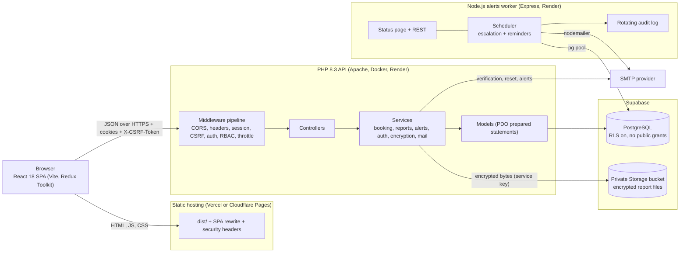
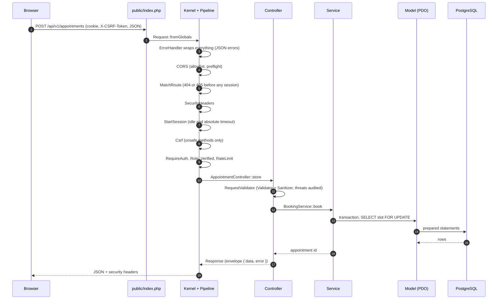
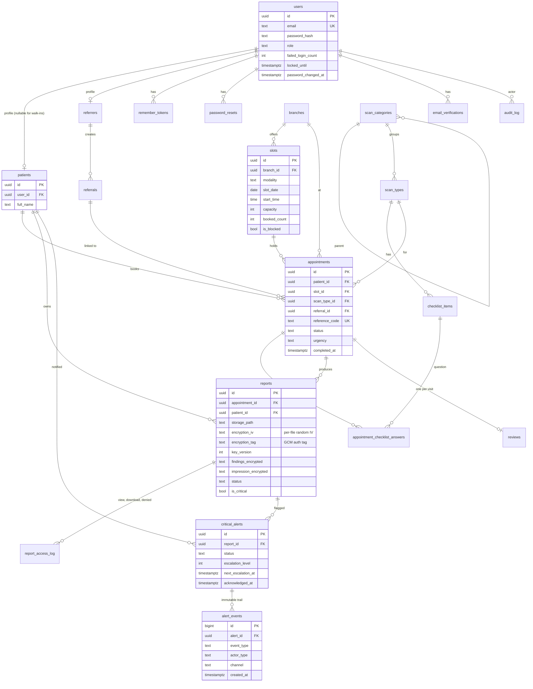
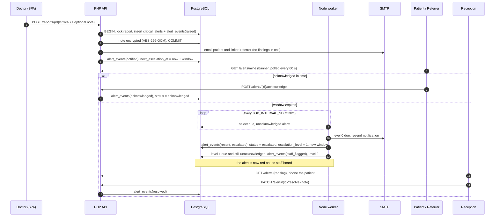

# Architecture

DiagnoCare has three runtime parts and one database: a React single page app, a plain PHP REST API, a Node.js worker for time-based jobs, and Supabase (PostgreSQL plus private object storage).

## System overview

Key points:

- The browser only ever talks to the static host and the PHP API. It never receives Supabase keys.
- Only the PHP API and the worker connect to the database, with the `diagnocare_app` role. Row Level Security with no policies blocks every other path.
- Report files are encrypted by PHP (AES-256-GCM) before they reach Storage.
- PHP creates a critical alert and sets `next_escalation_at`; the worker watches the table and escalates. They share `ALERT_ESCALATION_MINUTES`.

## Layers in the API

| Layer | Directory | Role |
|---|---|---|
| Front controller | `backend/public/index.php` | Loads config, registers the error handler, runs the kernel |
| Core | `backend/src/Core` | Router, Kernel, middleware Pipeline, Container, Session, Cookie, Csrf, Database |
| Middleware | `backend/src/Middleware` | Cross-cutting rules applied before controllers |
| Controllers | `backend/src/Controllers` | Parse input, call services, return `Response` |
| Services | `backend/src/Services` | Business rules (booking transaction, report storage, alert workflow) |
| Models | `backend/src/Models` | One class per table family; all SQL lives here |
| Validation | `backend/src/Validation` | `Validator`, `Sanitizer`, `RequestValidator` |

## Request lifecycle

Every response uses one envelope: `{ "data": ..., "error": null }` on success and `{ "data": null, "error": { "code", "message", "fields?" } }` on failure.

## Data model

Main tables (columns trimmed to keys and the fields that matter for the design). All entity ids are UUIDs; `alert_events`, `audit_log` and `report_access_log` are append-only logs.

Rules enforced in the schema (`database/migrations/`):

- One non-cancelled appointment per patient per slot (partial unique index in `005_scheduling.sql`).
- `slots.booked_count <= capacity` check; capacity is also guarded in code by row locks.
- `alert_events` cannot be updated, deleted or truncated (triggers in `007_alerts.sql`).
- Every table has Row Level Security enabled and no policies; `anon` and `authenticated` have no grants (`010_lock_down_public_roles.sql`).
- One review per appointment (`reviews.appointment_id` unique).
- Other tables not drawn: `branches`, `faqs`, `site_settings`, `login_attempts`, `rate_limits`, `audit_log`, `schema_migrations`.

## Critical alert flow

Every state change is a row in `alert_events`, so the full timeline can be shown to staff via `GET /alerts/{id}/events`. SMS exists as a documented stub (`backend/src/Services/Alerts/SmsGateway.php`, `services/alerts/src/channels/smsChannel.js`).

## Frontend structure

- Routing: `frontend/src/App.tsx` (lazy pages, public, auth, portal and admin trees).
- State: one Redux Toolkit store (`app/store.ts`) with `auth`, `booking`, `alerts` and `public` slices; local component state for UI-only concerns; Context only for the theme.
- API layer: `api/client.ts` adds the CSRF token, parses the envelope and throws `ApiError`; `hooks/useApi.ts` exposes loading and error state.
- Guards: `ProtectedRoute` and `GuestRoute` choose the destination from `lib/roles.ts`.

## Deployment topology

| Part | Host | Config |
|---|---|---|
| SPA | Vercel or Cloudflare Pages | `frontend/vercel.json`, `frontend/public/_redirects`, `frontend/public/_headers` |
| API | Render web service (Docker) | `backend/Dockerfile`, `render.yaml` |
| Worker | Render web service (Docker) | `services/alerts/Dockerfile`, `render.yaml` |
| Database and bucket | Supabase | `database/migrations`, `backend/bin/storage-setup.php` |

In production the SPA and API are on different sites, so the session cookie is `SameSite=None; Secure` and the API allows only the SPA origin through `CORS_ALLOWED_ORIGINS`. Details in the Deploy section of `README.md`.
